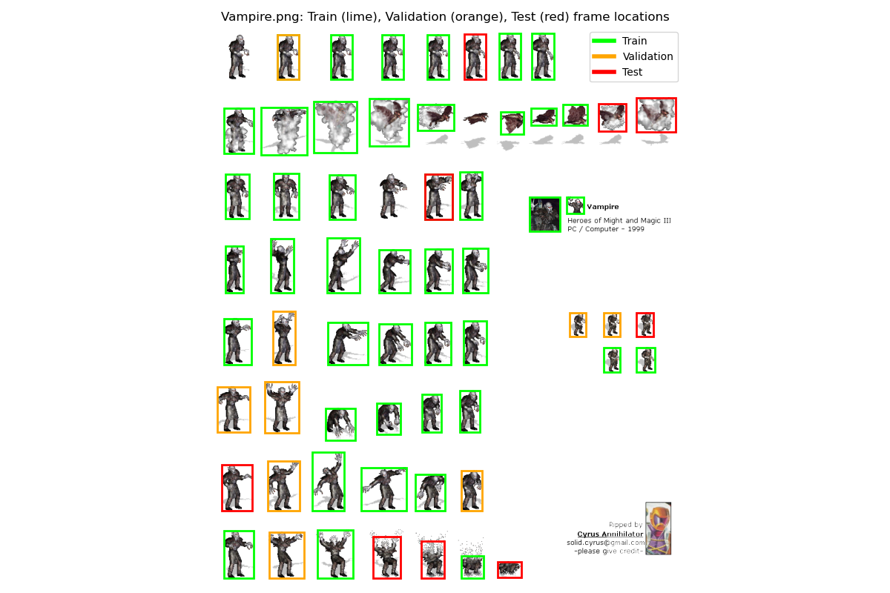

# Dataset Overview: Heroes of Might and Magic 3 Unit Recognition

This document provides an overview of the dataset used for training and evaluating the neural network for unit recognition in "Heroes of Might and Magic 3". Key visualizations are included to illustrate the dataset's structure and properties.

---

## File and Folder Structure

---

## Data Split

The dataset was divided according to the following distribution:
- **Training set:** 70% of all unit frames
- **Validation set:** 15% of all unit frames
- **Test set:** 15% of all unit frames

Splitting was performed in a stratified manner to ensure balanced class representation across all sets.

---

## Frame Size Distribution

**Description:**  
This chart shows the distribution of frame (sprite) sizes (width and height) in the dataset.  
- Most unit frames are clustered around the mean size, with a few outliers representing very large or very small frames.
- Filtering was applied to remove extremely small objects (such as arrows or spell effects) that are not actual units.

---

## Units Distribution Across Sets

**Description:**  
This bar chart displays the number of samples for each unit class across the training, validation, and test sets.  
- The dataset was split to ensure a balanced representation of units in each set.
- This helps prevent bias and improves the generalization of the trained neural network.

---

## Vampire Sprite Split Highlight

**Description:**  
This visualization highlights the bounding boxes of the "Vampire" unit frames on the original sprite sheet.  
- Different colors indicate which frames belong to the training, validation, and test splits.
- This helps verify that the dataset split covers the sprite sheet appropriately and that no data leakage occurs between sets.

---

## Summary

- The dataset was carefully curated and split to maximize training effectiveness and evaluation reliability.
- Visualizations were used throughout the process to ensure data quality and balance.
- For more details on the dataset preparation and splitting process, see the main [README.md](./README.md) and [progress_flow.md](./progress_flow.md).

---