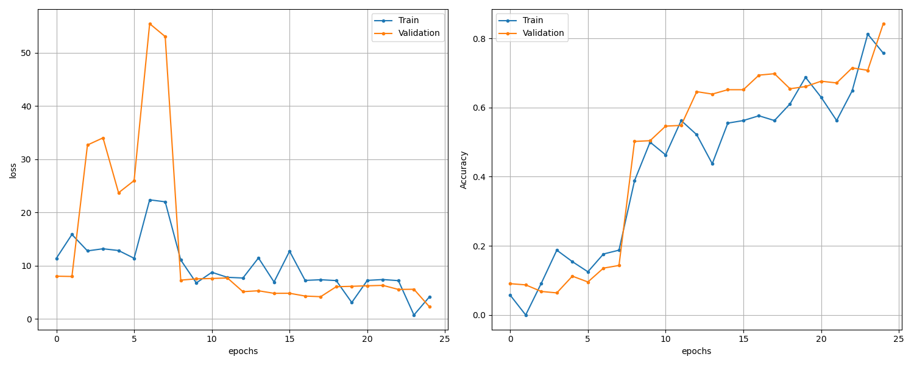

# Project Progress Flow: Heroes of Might and Magic 3 Unit Dataset

This document outlines my step-by-step progress, decisions, and key results throughout the Computer Vision final assessment project.

---

## Task 1. Dataset Preparation

After running object recognition without filtering frame sizes, the dataset contained many small frames, with a maximum size of 7x10 px. These objects needed to be filtered out from the dataset.

```
## Frame Size Distribution:
              Width        Height
count  80672.000000  80672.000000
mean      11.893073     13.409510
std       27.355985     29.061482
min        1.000000      1.000000
25%        1.000000      1.000000
50%        2.000000      1.000000
75%        6.000000      7.000000
max     1133.000000   1011.000000
```

```
## Values with high frequency (Width):
Width
1    39186
2     9421
6     6724
3     3820
5     2809
4     2494
7     2469
Name: count, dtype: int64
```

```
## Values with high frequency (Height):
Height
1     40899
2      8418
7      7856
10     3323
9      3207
3      2806
4      1257
Name: count, dtype: int64
```

### Small objects problem (noise)

Some frames are just additional objects, like:
- Zealot's fireball (e.g., 39x32, 37x36 pixels)
- Elf's arrow (22x22 pixels)
While some small frames of units on a map may also be small, like Wraith (32x32 px)

The signature avatar differs in size:
- 85x175
- 49x100
- etc.
Therefore, multi-scale template matching was performed.

To remove additional objects like arrows, fireballs, etc.:
- Filtering by color histogram similarity

### Author sign frame

Each PNG file has the author sign with an avatar. The data extraction script allows providing the `signature_avatar.png` file with the template that needs to be excluded from the dataset.

### Small avatar problem

There are normal avatars and small avatars in each frame set. The normal avatar is constant at 58x64px and has some colored background.
The small avatar bounding box size differs - approximately 30x30px, +/- 2-5px. However, this can be smaller.
The small avatar is usually a smaller copy of a normal avatar, but with a transparent background.
I used this information to match the avatars in the `task-1_extract_unit_frames.py` script.

**Python file:**
- [`task-1_extract_unit_frames.py`](./task-1_extract_unit_frames.py)
    Extracts unit frames from raw sprite sheets. Implements multi-scale template matching and color histogram similarity to identify and separate unit avatars and small objects. Saves extracted frames with annotations for further processing.

### Saving noisy frames separately

**Python file:**
- `task-1_extract_noise.py`
    Identifies and separates noisy frames (e.g., fireballs, arrows) from the main dataset. Uses color histogram similarity and size thresholds to filter out irrelevant objects. Saves the noisy frames in a separate folder for further analysis or exclusion.

### Improve CSV

#### New annotations
- frame_type: (unit, unit_avatar).
- bounding_box

### Structure

Split your dataset:
    Training set: 70%
    Validation set: 15%
    Test set: 15%

A dataset structure:
```
dataset/
  train/
    UnitA/
      frame_0.png
      frame_1.png
      ...
    UnitB/
      ...
  val/
    UnitA/
      ...
    UnitB/
      ...
  test/
    UnitA/
      ...
    UnitB/
      ...
annotations/
  train.csv
  val.csv
  test.csv
```

### Data quality recap

So far, I managed to get the best results from the automatic dataset generation. For future improvement of the dataset, I would think about better ways to recognize the additional items (they usually come in a row, have different mean histograms, and are of similar sizes).

Also, I would think about better ways to recognize the unit avatars.

In general, the dataset seems to lack enough frames. We will see that the TensorFlow warns us about this. I should probably look for more data augmentation options.

The dataset does not have frames with different backgrounds, which might be a problem in a production environment where all the units have a background. For further improvements, the dataset needs to be extended with unit frames from the game.

---

## Task 2. Generate the dataset

Generate a script to make a dataset in the `./dataset` folder. 
Make sure that units with frame_type="unit_avatar" stay in the training set. 
Use 15% for testing and 15% for validation sets. 
Pick the units randomly.

**Python file:**
- `task-2_generate_dataset.py`
  Splits the data into training, validation, and test sets, ensuring balanced class distribution and unique `Frame_ID` across all splits. Copies images and generates CSV annotation files for each split.

---

## Task 3. Inspect dataset

**Python file:**
- `task-3_dataset_inspection.py`
  Provides visualizations and statistics about the dataset, such as class distribution, frame sizes, and random sample images. Helps verify dataset balance and quality.

Based on the size distribution, for training the neural network, standardize the resize to all images to mean values 74x86.

```
Frame Size Distribution:
             Width       Height
count  9821.000000  9821.000000
mean     73.979635    85.744934
std      34.855930    24.469462
min      26.000000    26.000000
25%      47.000000    72.000000
50%      65.000000    88.000000
75%      93.000000   102.000000
max     271.000000   210.000000
```

### Visualize the annotations

A script to highlight bounding boxes from the CSV on a random PNG sprite.

**Python file:**
- `task-3_visualize_sprite_annotations.py`
  Prepares raw sprite and annotation data for further processing.

---

## Task 4. Train neural network

**Python file:**
- `task-4_train_network.py`
  Defines and trains a convolutional neural network using TensorFlow/Keras. Uses the generated dataset for training and validation. Saves the trained model for later inference.

### Data augmentation

For data augmentation, I used `horizontal_flip` for all runs. However, I would also like to experiment with `zoom_range` and other augmentation methods.

### run 1

I guessed a good setup for the network model with three convolutional blocks, batch normalization, max pooling, and dropout before the final Dense layer. I used `categorical_crossentropy` and `softmax` since I think this should better fit our use case with categorized units.

```
IMG_WIDTH, IMG_HEIGHT = 74, 86
BATCH_SIZE = 32
EPOCHS = 25
```

```
Training time: 1091.34 seconds
Train Acc      0.8721098303794861
Validation Acc 0.04444444552063942

Evaluating on test set...
Test loss: 34.3056
Test accuracy: 0.0042
```


Something is definitely wrong with the dataset.

I see that the unit distribution is not balanced across the train, val, and test sets. Need to fix the generation script to ensure unit distributions across sets.


After the fix and regenerating the dataset, the unit distribution looks much better.


### run 2

Run with the same parameters after optimizing the dataset.
```
Training time: 295.60 seconds
Train Acc      0.7574755549430847
Validation Acc 0.8426966071128845

Test loss: 2.1866
Test accuracy: 0.8491
```



This is much better!

It seems like we can continue training the dataset. Next time, let's double the number of epochs.
Also, let's add a Dropout before the last Dense layer.

The peak on the loss chart for epochs 6 and 7 seems to be related to not enough data in the datasets (see warning message below).
Now let's try to fix the warning by reducing the batch size. Not sure if the number of epochs also affects this warning... let's see.

#### Warning
```
UserWarning: Your input ran out of data; interrupting training. Make sure that your dataset or generator can generate at least `steps_per_epoch * epochs` batches. You may need to use the `.repeat()` function when building your dataset.
```

### run 3

```
BATCH_SIZE = 8
EPOCHS = 50
Model: added Dropout before the last Dense
```

```
Training time: 1168.33 seconds
Train Acc      0.75
Validation Acc 0.9073033928871155

Test loss: 1.1798
Test accuracy: 0.9214
```


Epoch 2 - running out of data warning

The training accuracy periodically drops, but overall the total test accuracy is 93%.

### run 4

For the next run, let's try to increase the batch size and decrease the number of epochs. With the bigger batch size, I expect the net will train quicker.

```
BATCH_SIZE = 32
EPOCHS = 25
```
```
Training time: 182.83 seconds
Train Acc      0.7268011569976807
Validation Acc 0.9197443127632141

Test loss: 1.3422
Test accuracy: 0.9158
```


I want to experiment more and get higher accuracy.

### run 5

Reducing batch_size to 24
Increasing training image size to 80, 96
- epochs 50
- reduced number of convolution levels
- removed dropout

```
Training time: 286.02 seconds
Train Acc      1.0
Validation Acc 0.9201977252960205

Test loss: 1.0539
Test accuracy: 0.9256
```


By reducing the number of convolution layers and removing dropout, we got the highest accuracy so far: 92.6%.

---

### Final Model

| Layer (type)                   | Output Shape       | Param #    |
|--------------------------------|--------------------|------------|
| conv2d (Conv2D)                | (None, 80, 96, 32) | 896        |
| max_pooling2d (MaxPooling2D)   | (None, 40, 48, 32) | 0          |
| conv2d_1 (Conv2D)              | (None, 40, 48, 64) | 18,496     |
| max_pooling2d_1 (MaxPooling2D) | (None, 20, 24, 64) | 0          |
| conv2d_2 (Conv2D)              | (None, 20, 24, 128)| 73,856     |
| max_pooling2d_2 (MaxPooling2D) | (None, 10, 12, 128)| 0          |
| flatten (Flatten)              | (None, 15360)      | 0          |
| dense (Dense)                  | (None, 256)        | 3,932,416  |
| dense_1 (Dense)                | (None, 138)        | 35,466     |

### Evaluation per class accuracy

If we run our model over the test data, we get the following result:


For most classes, the accuracy is 100%, however for some units it is pretty low. I think this is related to the data quality distribution. Let's look at what the Vampire unit looks like:


So in the validation set there are only standing vampire units. However, for the testing set, approximately 60% of frames are flying animation. While in the training set, the flying frames take up approximately 15% of the whole set. So I guess the model did not learn the flying animation for the Vampire.

---

## Task 5. Test on a screenshot

**Python file:**

So far, I haven't managed to recognize the units on the game screenshot.

---
